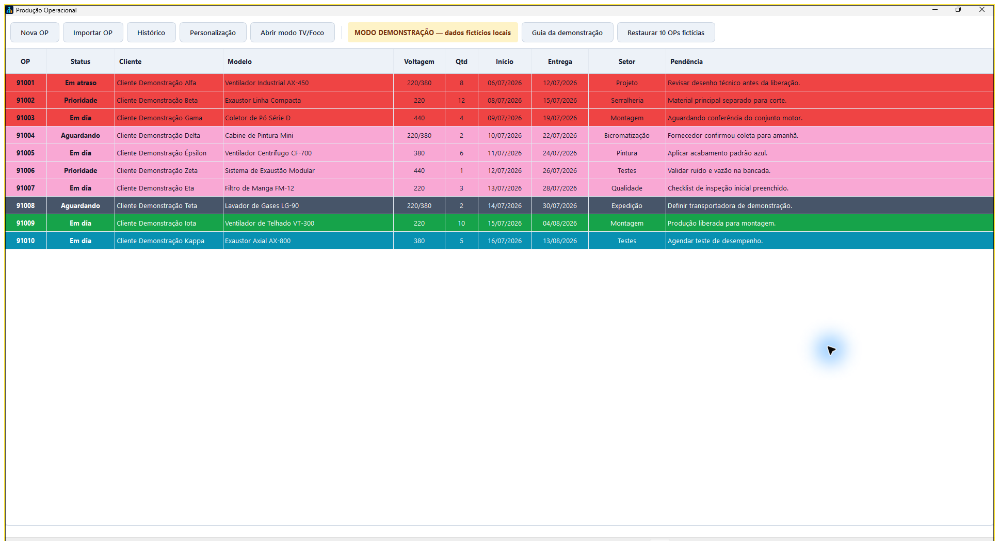
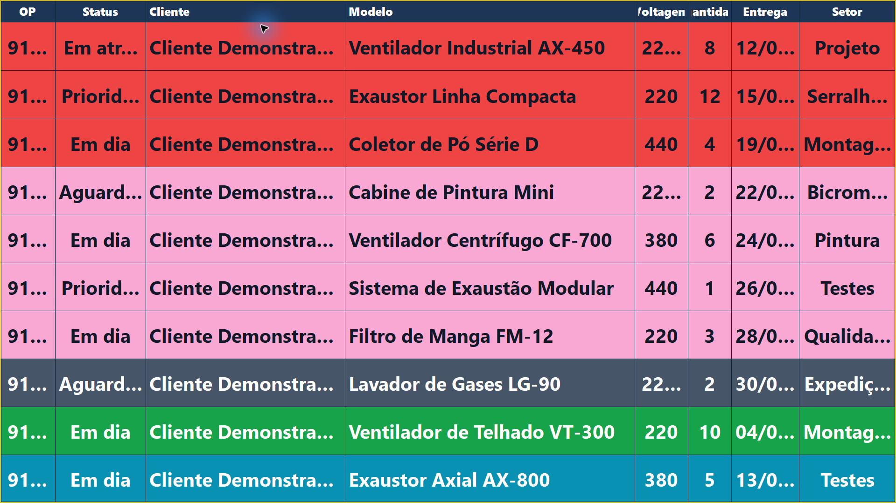
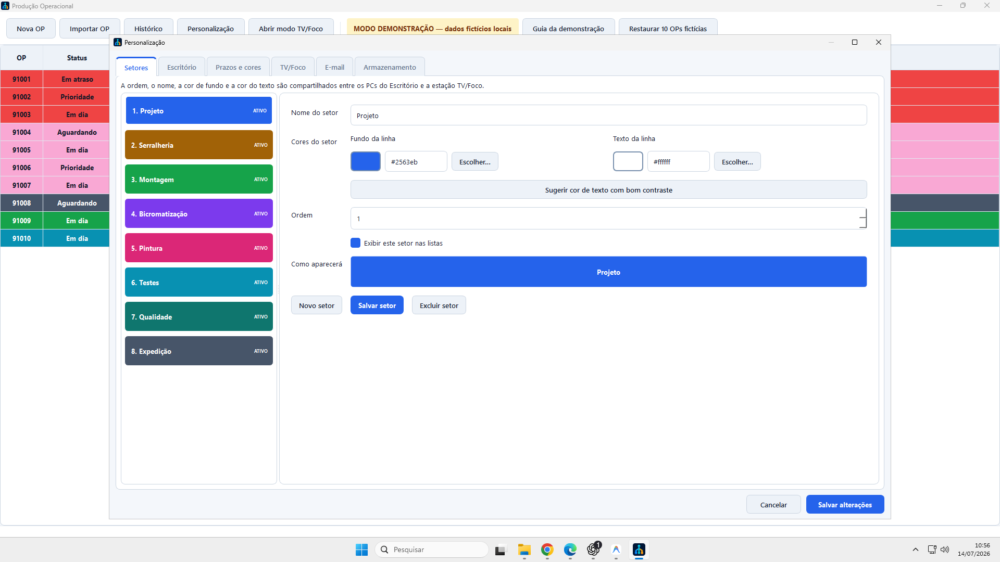
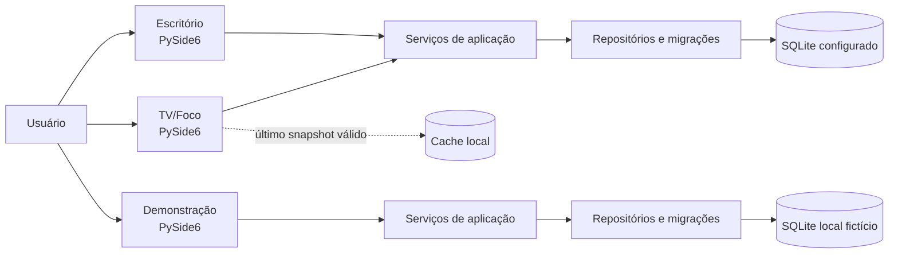

# Produção Operacional


> Aplicação desktop Windows para organizar ordens de produção em estações de trabalho, painel TV/Foco e uma demonstração totalmente local.


## Visão geral

**Produção Operacional** nasceu para tornar o acompanhamento de OPs simples em dois contextos complementares:

- **Escritório:** consulta, cadastro, edição, histórico, check de acompanhamento e importação revisável de documentos;
- **TV/Foco:** painel em tela cheia, paginado e configurável para visualização coletiva;
- **Demonstração:** ambiente seguro para apresentar e praticar o sistema com **10 OPs fictícias**, sem depender de rede, NAS, SMTP ou dados operacionais.

O projeto enfatiza uma experiência direta para operação diária e uma arquitetura preparada para estações em rede: banco SQLite central configurável, cache local para leitura e configuração compartilhada onde isso faz sentido.

## Produto em funcionamento

As imagens abaixo são capturas do aplicativo Windows empacotado, executado no modo Demonstração com dados fictícios locais. Elas mostram os dois contextos que desenhei para a operação: gestão detalhada no Escritório e comunicação visual à distância na TV/Foco.

| Escritório — gestão diária de OPs | TV/Foco — acompanhamento coletivo |
| --- | --- |
|  |  |

| Personalização — setores, cores e contraste |
| --- |
|  |

## O que desenvolvi neste produto

Criei o **Produção Operacional** para que uma OP não fosse apenas um registro em uma tabela, mas parte de um fluxo de trabalho claro para quem executa e para quem acompanha a produção.

- Modelei a rotina de **cadastro, edição, histórico e check de acompanhamento**, incluindo validações de datas e tensão para reduzir erros no preenchimento.
- Separei a experiência de **Escritório** da **TV/Foco**: uma tela para trabalhar em detalhes e outra, em tela cheia, para comunicar prioridades e andamento para a equipe.
- Implementei a **personalização operacional** de setores, contraste, temas claro/escuro e disposição do painel para que o sistema se adapte ao ambiente, não o contrário.
- Estruturei persistência em **SQLite**, cache de leitura, migrações, importação revisável de documentos e empacotamento Windows.
- Incluí o modo **Demonstração** como uma experiência completa e isolada: ele permite explorar os mesmos fluxos com 10 OPs fictícias locais, sem tocar em dados de trabalho.

<details>
<summary><strong>English summary</strong></summary>

Production Operations is a Windows desktop application built with Python, PySide6 and SQLite. It supports office workstations, a full-screen production dashboard and a fully isolated local demo mode with fictional data. The project demonstrates desktop UX, layered architecture, document import, resilient SQLite persistence, packaging and automated tests.

</details>

## Destaques técnicos

| Área | O que foi construído |
| --- | --- |
| Desktop | Interface nativa em Python/PySide6, com componentes reutilizáveis e fluxo pensado para produtividade. |
| Dados | SQLite com repositórios, migrações, backup antes de alterações de schema e tratamento de indisponibilidade temporária. |
| Multiestação | Perfis de instalação para Escritório, TV/Foco e Demonstração; preferências locais e configurações compartilháveis. |
| Resiliência | Cache local de leitura para manter a TV/Foco útil mesmo durante falhas transitórias de rede. |
| Importação | Prévia revisável de PDF, DOCX e ODT; extração de campos em português e fallback de OCR para PDFs digitalizados. |
| Personalização | Setores com cores e contraste próprios, tema claro/escuro no Escritório e layout detalhado da TV/Foco. |
| Qualidade | Suite automatizada com regras de negócio, migrações, importação, temas, TV/Foco e isolamento do modo demo. |

## Modos de uso

| Modo | Finalidade | Dados utilizados | Acesso à rede |
| --- | --- | --- |
| **Escritório** | Gerenciar o fluxo de OPs. | Banco configurado pela organização. | Conforme a configuração local. |
| **TV/Foco** | Exibir o andamento da produção em painel. | Leitura do banco configurado e cache local. | Usa cache quando a fonte não está disponível. |
| **Demonstração** | Apresentar, treinar e explorar recursos com segurança. | SQLite local com 10 OPs fictícias. | **Nenhum.** |

O modo Demonstração abre inicialmente em Escritório. A pessoa pode cadastrar, editar, personalizar, abrir a TV/Foco e, quando quiser recomeçar, restaurar as dez OPs originais. Nenhuma ação nesse modo alcança dados reais.

## Arquitetura



## Recursos da interface

- Cadastro e edição de OPs, status, histórico e Check Acompanhamento;
- Lista operacional com setores e indicação visual de prazos;
- Importação revisável de documentos PDF, DOCX e ODT;
- Normalização de data e tensão para reduzir erros de digitação;
- Setores com nome, ordem, disponibilidade, cor de fundo e cor de texto;
- Painel TV/Foco com paginação, escala, colunas, formatos de data e prévia em tela ampliada;
- Temas **Seguir o Windows**, **Claro** e **Escuro** no modo Escritório;
- Guia integrado e restauração dos dados no modo Demonstração.

## Executar localmente

### Pré-requisitos

- Windows 10/11;
- Python 3.12 ou superior;
- Para a importação com OCR: [Tesseract OCR](https://github.com/tesseract-ocr/tesseract) e Poppler instalados localmente (opcional).

### Demonstração — experimente o fluxo completo

```powershell
python -m venv .venv
.\.venv\Scripts\Activate.ps1
python -m pip install -r requirements-dev.txt
python run_app.py --demo
```

Esse comando não exige configuração de servidor e cria os dados fictícios apenas no perfil local do Windows.

### Ambiente configurado

1. Copie `config/settings.example.json` para `config/settings.json`.
2. Preencha os caminhos de armazenamento que pertencem ao seu ambiente.
3. Mantenha `config/settings.json` fora do Git — ele já está protegido pelo `.gitignore`.
4. Inicie a aplicação:

```powershell
python run_app.py
```

> Nunca coloque caminhos internos, bases de produção, senhas SMTP ou dados de clientes em commits públicos.

## Testes

```powershell
$env:QT_QPA_PLATFORM = "offscreen"
python -m pytest -q
```

Os testes não dependem de documentos corporativos: as amostras necessárias são geradas em tempo de execução.

## Gerar o instalador Windows

O projeto contém um script de build para PyInstaller + Inno Setup 6. O procedimento exige um `config/settings.json` local e sem senha SMTP:

```powershell
powershell -NoProfile -ExecutionPolicy Bypass -File .\scripts\build_inno_setup.ps1
```

O instalador apresenta os três perfis que fazem parte do produto: **Escritório** para operação detalhada, **TV/Foco** para visualização coletiva e **Demonstração** para experimentar o fluxo completo com dados fictícios locais.

## Estrutura do projeto

```text
src/kanban_app/
├── application/     # Casos de uso, DTOs e regras de aplicação
├── domain/          # Entidades, enums e regras de negócio
├── infrastructure/  # SQLite, configuração, cache, logs e runtime
└── presentation/    # Janelas, widgets e temas PySide6
assets/              # Ícone e imagens públicas do projeto
config/              # Modelo de configuração, sem dados reais
scripts/             # Empacotamento e instalador Windows
tests/               # Testes automatizados
```

## Privacidade dos dados

Este é o repositório autoral de portfólio do produto. Ele preserva a arquitetura, as telas e os fluxos que desenvolvi; as OPs exibidas nas imagens e no modo Demonstração são fictícias exclusivamente para proteger informações confidenciais. Configurações de ambiente, documentos operacionais, bancos de dados, credenciais e referências de infraestrutura não fazem parte do repositório público.

## Contato

**Mayconxzdev**<br>
[GitHub](https://github.com/Mayconxzdev) · [mayconxz00dev@gmail.com](mailto:mayconxz00dev@gmail.com)
