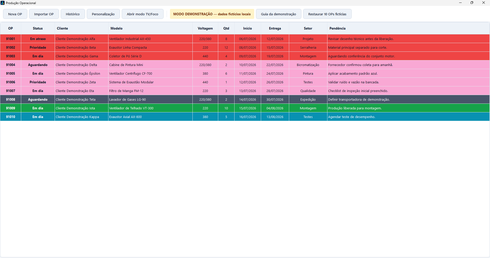
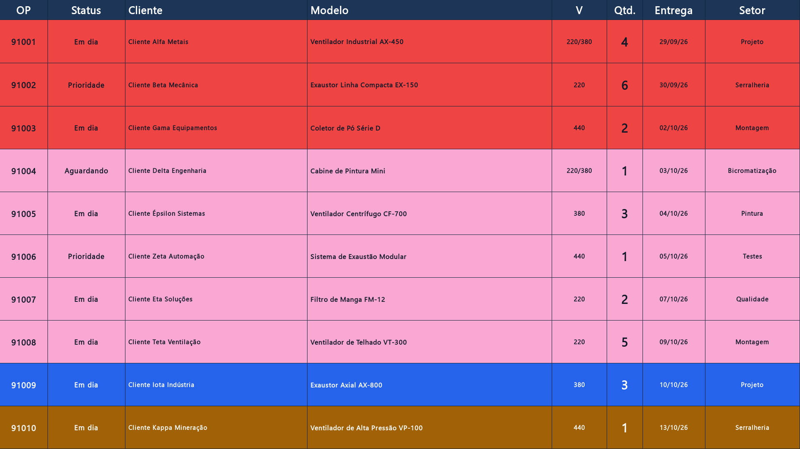
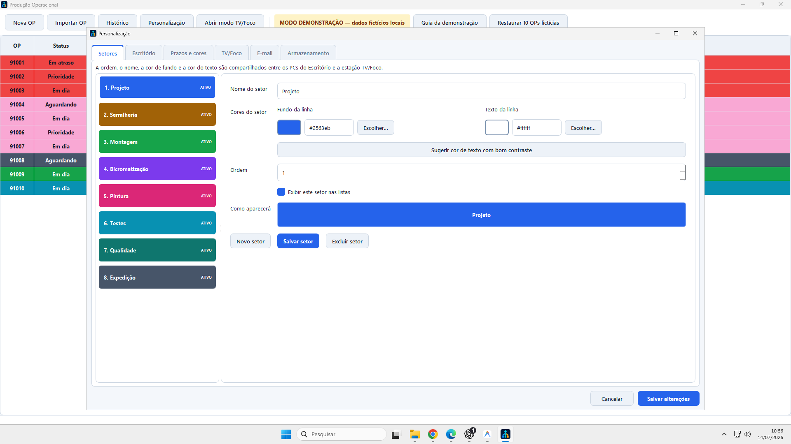
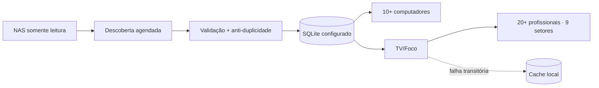

# Produção Operacional


> Aplicação desktop Windows para organizar ordens de produção no escritório, automatizar a entrada de novas OPs e manter uma visão coletiva em TV/Foco na fábrica.


[](LICENSE)

## Visão geral

Criei o **Produção Operacional** para organizar as ordens de produção no escritório e oferecer uma visão coletiva na fábrica. O sistema também acompanha uma origem configurada no NAS e inclui automaticamente novas OPs nos horários definidos pela operação.

| Aspecto | Situação atual |
|---|---|
| **Implantação** | Versão interna instalada em 10+ computadores e uma TV de fábrica. |
| **Alcance** | Apoia 20+ profissionais distribuídos em nove setores produtivos, além da gestão no escritório. |
| **Uso diário** | A TV/Foco funciona como referência coletiva para identificar novas OPs e acompanhar onde cada ordem está no processo. |
| **Automação** | Uma estação integradora verifica documentos novos no NAS. Na implantação atual, a rotina executa de segunda a sexta às 10h e 15h. |
| **Continuidade** | NAS somente leitura, linha de base para não reimportar documentos antigos, cache local e bloqueio de OP duplicada. |
| **Minha atuação** | Produto, arquitetura, interface, banco, migrações, importação, instalador, implantação, treinamento e sustentação. |

## Modos de uso

- **Escritório:** consulta, cadastro, edição, histórico, check de acompanhamento e importação revisável;
- **TV/Foco:** painel em tela cheia, paginado e configurável para visualização coletiva na fábrica;
- **Demonstração:** ambiente local com dez OPs fictícias, sem acessar NAS, banco ou documentos empresariais.

A arquitetura usa SQLite configurável, cache local para leitura, migrações, perfis de instalação e integração agendada. A edição pública mantém o funcionamento do produto e substitui todos os dados reais por exemplos.

## Interface

### Escritório



### TV/Foco



### Setores e contraste



## O que desenvolvi

- cadastro, edição, histórico, status e check de acompanhamento;
- experiências separadas para o trabalho detalhado no Escritório e a comunicação visual na TV/Foco;
- setores configuráveis com nome, ordem, disponibilidade, cores e contraste;
- temas claro, escuro e alinhado ao Windows;
- SQLite com repositórios, migrações e backup antes de alterações de schema;
- cache local para manter a TV útil durante indisponibilidades transitórias da fonte;
- importação revisável de PDF, DOCX e ODT, com OCR opcional para documentos digitalizados;
- empacotamento com PyInstaller e instalador Inno Setup;
- modo Demonstração isolado;
- tarefa agendada para descobrir apenas novas OPs em uma estrutura de pastas configurada.

## Integração automática de novas OPs

A estação integradora consulta a origem configurada em dias e horários definidos pela operação. Na implantação atual, a verificação ocorre **de segunda a sexta às 10h e 15h**. Os horários são configuráveis e a edição pública mantém exemplos neutros.

O fluxo:

1. cria uma linha de base dos documentos existentes na primeira execução;
2. nas execuções seguintes, procura somente arquivos novos;
3. extrai número da OP, cliente, modelo, quantidade, tensão e prazo;
4. rejeita registros incompletos ou números já existentes;
5. grava a nova OP no banco para consulta no escritório e exibição na TV;
6. não move, renomeia ou apaga arquivos do NAS.


```mermaid
flowchart LR
    NAS["NAS somente leitura"] --> DISC["Descoberta agendada"]
    DISC --> VALID["Validação + anti-duplicidade"]
    VALID --> DB[("SQLite configurado")]
    DB --> OFFICE["10+ computadores"]
    DB --> TV["TV/Foco"]
    TV --> TEAM["20+ profissionais · 9 setores"]
    TV -. falha transitória .-> CACHE[("Cache local")]
```

## Arquitetura

```text
src/kanban_app/
├── application/     # casos de uso, DTOs e regras de aplicação
├── domain/          # entidades, enums e regras de negócio
├── infrastructure/  # SQLite, configuração, cache, logs e runtime
└── presentation/    # janelas, widgets e temas PySide6
assets/              # ícone e imagens públicas
config/              # modelo de configuração, sem dados reais
scripts/             # empacotamento e instalador Windows
tests/               # testes automatizados
```

## Executar a demonstração

Pré-requisitos: Windows 10/11 e Python 3.12+.

```powershell
python -m venv .venv
.\.venv\Scripts\Activate.ps1
python -m pip install -r requirements-dev.txt
python run_app.py --demo
```

O modo Demonstração não exige servidor e não acessa dados empresariais.

## Testes

```powershell
$env:QT_QPA_PLATFORM = "offscreen"
python -m pytest -q
```

Os testes cobrem regras de negócio, migrações, importação, temas, TV/Foco e isolamento do modo demo.

## Build Windows

```powershell
powershell -NoProfile -ExecutionPolicy Bypass -File .\scripts\build_inno_setup.ps1
```

O instalador suporta os perfis Escritório, TV/Foco e Demonstração e permite definir uma estação integradora separadamente.

## Estado e limites

- OPs, documentos, caminhos, configurações, credenciais e bancos empresariais não fazem parte do repositório;
- as capturas usam dados fictícios;
- o produto atual atende a uma operação interna; uma expansão multiunidade exigiria identidade corporativa, telemetria, banco transacional central e observabilidade;
- OCR é opcional e toda importação permanece revisável.

## Autor

**Maycon Ferreira** — levantamento, produto, arquitetura, desenvolvimento, implantação, treinamento, monitoramento e sustentação.

## Licença

Distribuído sob a [licença MIT](LICENSE).
