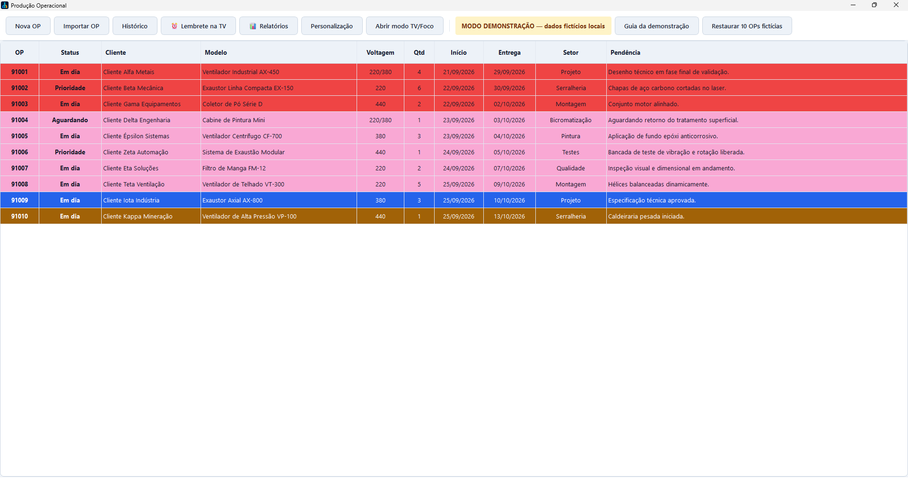
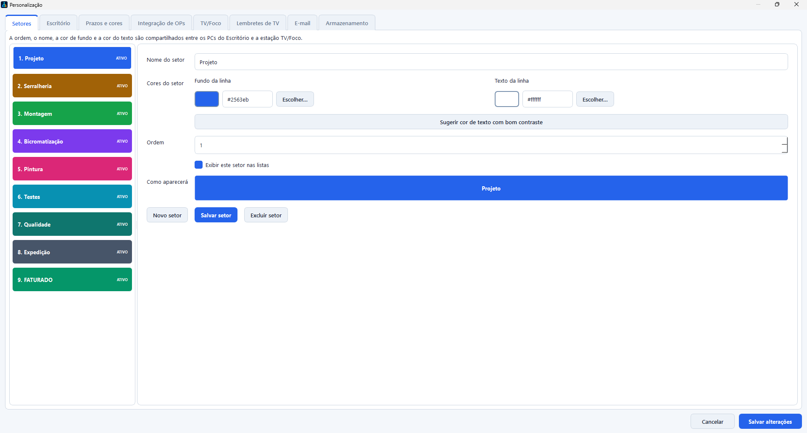
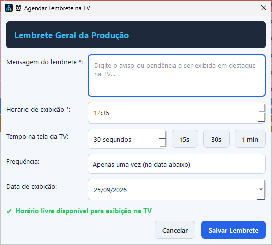
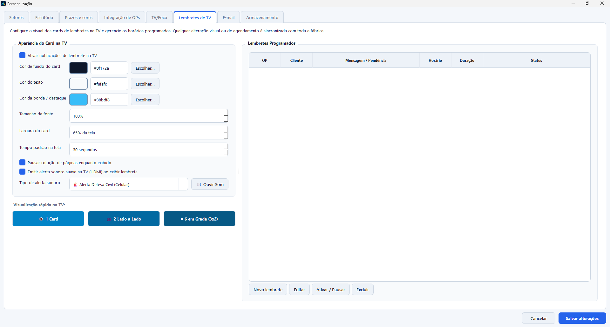
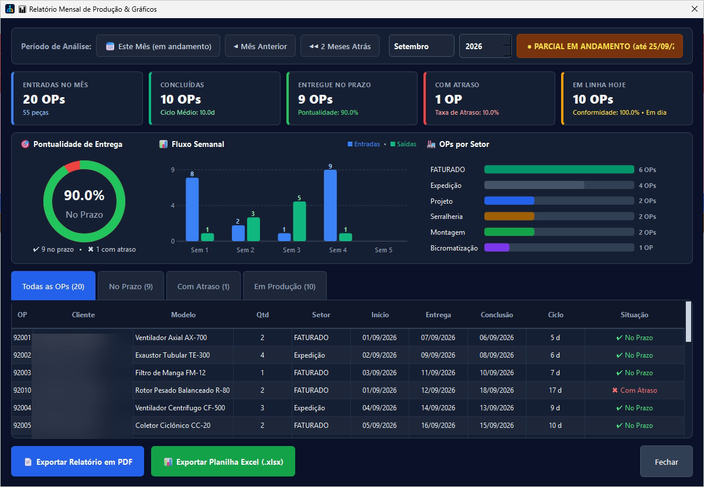

<div align="center">


# Produção Operacional

**Aplicação desktop Windows implantada em 10+ computadores e 1 TV de fábrica, apoiando 20+ profissionais em 9 setores produtivos.**


[](https://github.com/Mayconxzdev/ProducaoOperacional/actions/workflows/tests.yml)
[](LICENSE)

[Case no portfólio](https://mayconxzdev.github.io/cases/producao-operacional/) · [Executar demonstração](#executar-a-demonstração) · [Arquitetura](#arquitetura)



</div>

> Aplicação desktop Windows para organizar ordens de produção no escritório, automatizar a entrada de novas OPs e manter uma visão coletiva em TV/Foco na fábrica.

## Visão geral

Criei o **Produção Operacional** para organizar ordens de produção no escritório e compartilhar o andamento com a fábrica. O sistema também permite programar lembretes para a TV/Foco e consultar relatórios mensais de produção.

| Aspecto | Situação atual |
|---|---|
| **Implantação** | Versão interna instalada em 10+ computadores e uma TV de fábrica. |
| **Alcance** | Apoia 20+ profissionais distribuídos em nove setores produtivos, além da gestão no escritório. |
| **Uso diário** | A TV/Foco funciona como referência coletiva para identificar novas OPs e acompanhar onde cada ordem está no processo. |
| **Automação** | Uma estação integradora verifica a origem configurada conforme a agenda definida pela operação. |
| **TV/Foco** | Lembretes podem ser programados com mensagem, dia, horário, frequência e duração. |
| **Relatórios** | A equipe escolhe o mês e exporta o relatório de produção em PDF ou Excel. |
| **Continuidade** | Importação revisável, bloqueio de OP duplicada e cache local para leitura durante falhas transitórias. |
| **Minha atuação** | Produto, arquitetura, interface, banco, migrações, importação, instalador, implantação, treinamento e sustentação. |

## Modos de uso

- **Escritório:** consulta, cadastro, edição, histórico, check de acompanhamento e importação revisável;
- **TV/Foco:** painel em tela cheia, paginado e configurável para visualização coletiva na fábrica;
- **Demonstração:** ambiente local com dez OPs fictícias, sem acessar NAS, banco ou documentos empresariais.

A arquitetura usa SQLite configurável, cache local para leitura, migrações, perfis de instalação e integração agendada. A edição pública mantém o funcionamento do produto e substitui todos os dados reais por exemplos.

## Interface

As telas que mostram ordens vêm do modo Demonstração, com registros fictícios. Na captura do relatório mensal, os nomes de clientes foram desfocados.

### Escritório — modo Demonstração


### TV/Foco


### Setores e contraste



### Lembretes na TV



A pessoa define a mensagem, o dia e o horário em que o aviso deve aparecer e ajusta sua frequência e duração na tela.



### Relatórios mensais



O relatório reúne indicadores, gráficos e ordens do mês selecionado. Os nomes de clientes estão desfocados nesta captura.

## O que desenvolvi

- cadastro, edição, histórico, status e check de acompanhamento;
- experiências separadas para o trabalho detalhado no Escritório e a comunicação visual na TV/Foco;
- setores configuráveis com nome, ordem, disponibilidade, cores e contraste;
- temas claro, escuro e alinhado ao Windows;
- SQLite com repositórios, migrações e backup antes de alterações de schema;
- cache local para manter a TV útil durante indisponibilidades transitórias da fonte;
- importação revisável de PDF, DOCX e ODT, com OCR opcional para documentos digitalizados;
- lembretes gerais ou ligados a uma OP, programados para aparecer na TV/Foco em dia e horário definidos;
- relatório mensal com indicadores e gráficos, exportável em PDF vetorial ou planilha Excel;
- empacotamento com PyInstaller e instalador Inno Setup;
- modo Demonstração isolado;
- tarefa agendada para descobrir apenas novas OPs em uma estrutura de pastas configurada.

## Decisões e trade-offs

- Mantive o aplicativo nativo para Windows e usei SQLite configurável para aproveitar as estações já disponíveis na operação. Isso simplifica a implantação local, mas exige cuidar da configuração e das atualizações em cada estação.
- A TV/Foco guarda um cache local de leitura para continuar mostrando o último estado válido durante uma falha temporária. O cache ajuda na visualização; alterações continuam dependendo da fonte configurada.
- Separei o modo Demonstração, com banco local próprio e ordens fictícias, para que seja possível conhecer e testar os fluxos sem alcançar o ambiente de trabalho.

## Integração automática de novas OPs

A aplicação pode procurar documentos novos em uma origem configurada pela equipe e executar a verificação na agenda definida para a estação integradora. A primeira execução registra uma linha de base; as seguintes analisam somente novos arquivos, validam os campos necessários e evitam importar números já existentes. A origem permanece somente leitura: o fluxo não move, renomeia nem apaga os arquivos.

Os caminhos, horários e demais valores operacionais são definidos localmente e não fazem parte desta documentação pública.

## Arquitetura

```text
src/kanban_app/
├── application/     # casos de uso, DTOs e regras de aplicação
├── domain/          # entidades, enums e regras de negócio
├── infrastructure/  # SQLite, configuração, cache, logs e runtime
└── presentation/    # janelas, widgets e temas PySide6
assets/              # ícone e imagens públicas
config/              # modelo de configuração, sem dados reais
scripts/             # empacotamento e instalador Windows
tests/               # testes automatizados
```

## Executar a demonstração

Pré-requisitos: Windows 10/11 e Python 3.12+.

```powershell
python -m venv .venv
.\.venv\Scripts\Activate.ps1
python -m pip install -r requirements-dev.txt
python run_app.py --demo
```

O modo Demonstração não exige servidor e não acessa dados empresariais.

## Testes

```powershell
$env:QT_QPA_PLATFORM = "offscreen"
python -m pytest -q
```

Os testes cobrem regras de negócio, migrações, importação, temas, TV/Foco e isolamento do modo demo.

## Build Windows

```powershell
powershell -NoProfile -ExecutionPolicy Bypass -File .\scripts\build_inno_setup.ps1
```

O instalador suporta os perfis Escritório, TV/Foco e Demonstração e permite definir uma estação integradora separadamente.

## Estado e limites

- bancos empresariais, documentos, caminhos e configurações reais não fazem parte do repositório;
- as telas de demonstração usam OPs fictícias; os nomes de clientes na captura do relatório mensal foram desfocados;
- o produto atual atende a uma operação interna; uma expansão multiunidade exigiria identidade corporativa, telemetria, banco transacional central e observabilidade;
- OCR é opcional e toda importação permanece revisável.

## Autor

**Maycon Ferreira** — levantamento, produto, arquitetura, desenvolvimento, implantação, treinamento, monitoramento e sustentação.

## Licença

Distribuído sob a [licença MIT](LICENSE).
